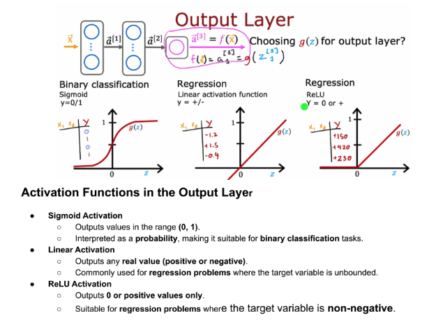
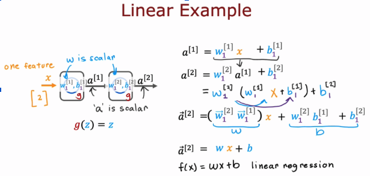
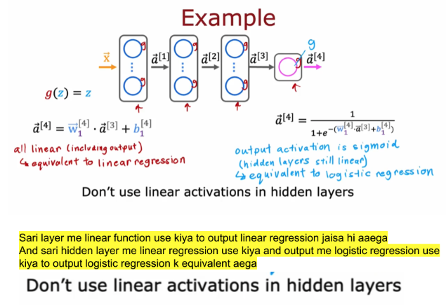

---

# 📘 Activation Functions — Notes

---

## 🔹 What is an Activation Function?


An **activation function** defines how a neuron transforms its input:

[
a = g(z)
]

* ( z = wx + b )
* ( g(z) ) introduces **non-linearity**
* Without it → neural networks become useless for complex tasks

---

## 🔵 ReLU (Rectified Linear Unit)

[
g(z) = \max(0, z)
]

### ✅ Key Properties

* Outputs **0 if z < 0**
* Outputs **z if z ≥ 0**
* Adds **non-linearity**
* Helps reduce **vanishing gradient problem**

### 📈 Visualization

```
     |
  z  |        /
     |       /
     |      /
     |_____/
           0
```

### 📌 Usage

* Most common in **hidden layers**

---

## 🟣 Sigmoid

[
g(z) = \frac{1}{1 + e^{-z}}
]

### ✅ Key Properties

* Output range: **(0, 1)**
* Interpreted as **probability**

### 📈 Visualization

```
      1 |      ______
        |     /
        |    /
        |   /
        |  /
      0 |_/________
```

### 📌 Usage

* **Binary classification output layer**

### ⚠️ Problem

* Suffers from **vanishing gradients** when |z| is large

---

## ⚫ Linear Activation

[
g(z) = z
]

### ✅ Key Properties

* No transformation (just identity)
* No non-linearity

### 📌 Usage

* **Regression output layer**

### ❌ Limitation

* If used everywhere → model becomes **linear only**

---

## 🚨 Important Concept

### ❗ Why NOT use Linear in Hidden Layers?




If all layers use linear activation:

[
g(g(g(x))) = ax + b
]

👉 Entire network becomes:

> Equivalent to **linear regression** 


### ❌ Result:

* Cannot learn **complex patterns**
* No benefit of deep learning


---

## 🟡 Softmax Activation (Multi-class)

Used when:

* Output has **more than 2 classes**

### Example:

Classes = {Cat, Dog, Bird}

Softmax converts:

[
z_1, z_2, z_3 --> a_1, a_2, a_3
]

### ✅ Key Idea

* All outputs sum to **1**
* Each output = **probability**

---

## 🔥 Key Difference (Softmax vs Sigmoid)

* **Sigmoid**:

  * Each output depends on its own (z)

* **Softmax**:

  * Each output depends on **ALL (z)'s**

👉 This creates **competition between classes** 

---

## 📉 Cost Function (Loss)

### 🔹 Logistic Regression (Sigmoid)

* If (y = 1):
  [
  \text{Loss} = -\log(a)
  ]

* If (y = 0):
  [
  \text{Loss} = -\log(1 - a)
  ]

---

### 🔹 Softmax Loss (Multi-class)

[
\text{Loss} = -\log(a_k)
]

* (a_k) = predicted probability of correct class 

---

## ⚙️ Adam Optimization Algorithm

### 🧠 Intuition

* If learning is **too slow** → increase learning rate
* If oscillating/diverging → decrease learning rate

### 🚀 Key Feature

* Uses **different learning rates for each parameter**
* Adapts based on **past gradients**

👉 More efficient than standard gradient descent 

---

## 🧩 Summary Table

| Function | Formula         | Range       | Use Case              |
| -------- | --------------- | ----------- | --------------------- |
| ReLU     | max(0, z)       | [0, ∞)      | Hidden layers         |
| Sigmoid  | 1 / (1+e⁻ᶻ)     | (0,1)       | Binary classification |
| Linear   | z               | (-∞, ∞)     | Regression            |
| Softmax  | exp(zᵢ)/Σexp(z) | (0,1) sum=1 | Multi-class           |

---

## 🧠 Final Takeaway

* **ReLU** → Enables piecewise learning (like your previous diagram)
* **Sigmoid** → Probability for binary output
* **Softmax** → Probability distribution for multiple classes
* **Linear** → Only for regression outputs

---